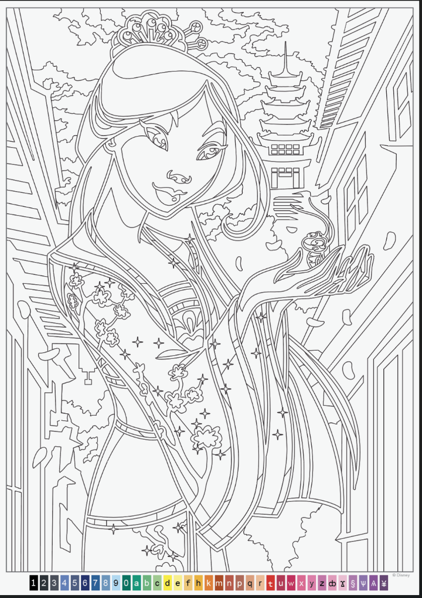
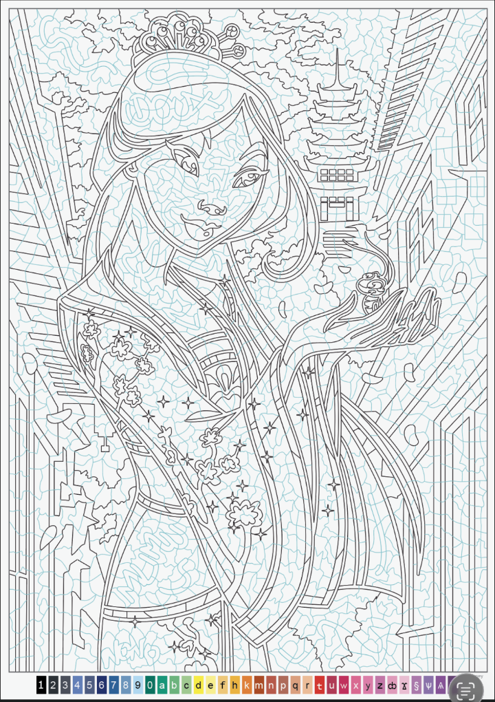

# craquelure_organique.jsx

Script ExtendScript pour Adobe Illustrator qui génère un réseau de craquelures organiques (effet mosaïque / voronoï fait-main) par-dessus un coloriage vectoriel.

## Avant / Après

| Avant | Après |
|-------|-------|
|  |  |

## Utilisation

1. Ouvrez votre fichier `.ai` dans Adobe Illustrator
2. `File > Scripts > Other Script...`
3. Sélectionnez `craquelure_organique.jsx`
4. Attendez quelques secondes — un layer `"Craquelures"` apparaît automatiquement sous votre dessin

## Paramètres

Tous les paramètres sont configurables en tête du script :

| Paramètre | Défaut | Description |
|-----------|--------|-------------|
| `NUM_POINTS` | `400` | Nombre de points de base (densité du réseau) |
| `MAX_DIST` | `70` | Distance max (pt) entre deux points pour les relier — contrôle la taille des cellules |
| `STROKE_R/G/B` | `100, 180, 220` | Couleur du trait en RGB (défaut : bleu clair) |
| `STROKE_WIDTH` | `0.5` | Épaisseur du trait en points |
| `CURVE_NOISE` | `12` | Amplitude de déformation des courbes de Bézier (aspect organique) |
| `LAYER_NAME` | `"Craquelures"` | Nom du layer créé dans le document |

## Comment ça marche

1. Le script sème `NUM_POINTS` points aléatoires sur toute la surface du document
2. Des points supplémentaires sont ajoutés sur les 4 bords pour que le réseau atteigne les marges
3. Chaque paire de points dont la distance est inférieure à `MAX_DIST` est reliée par une courbe de Bézier cubique
4. Les points de contrôle Bézier sont déviés aléatoirement (perpendiculairement au segment) pour l'aspect organique
5. Toutes les courbes sont placées dans un layer dédié, sous les layers existants

## Performance

La génération est en O(n²) sur le nombre de points. Pour les gros documents :
- 400 points → quelques secondes
- Réduire `NUM_POINTS` à 250 si le script est trop lent
- Augmenter `NUM_POINTS` à 600+ pour un réseau plus dense

## Prérequis

- Adobe Illustrator (toute version supportant ExtendScript)
- Un document `.ai` ouvert
